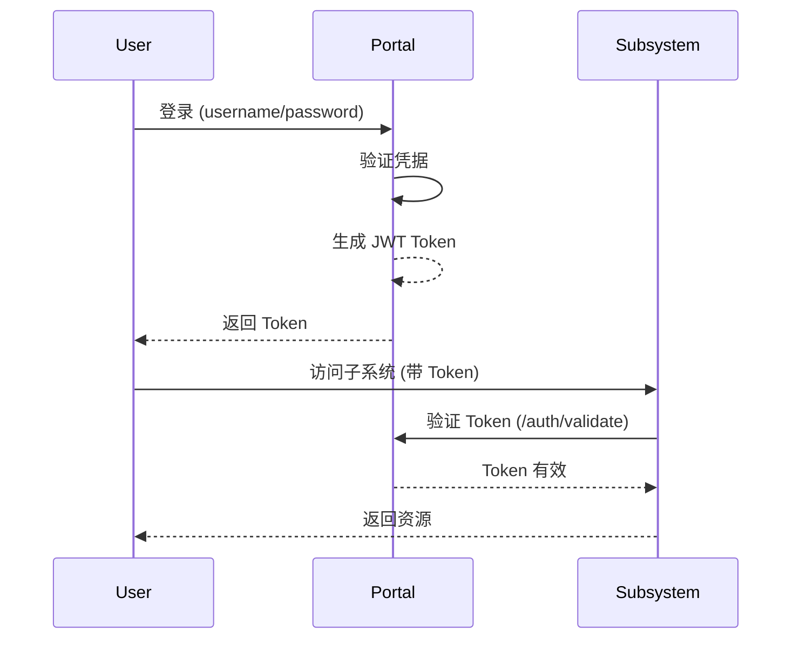
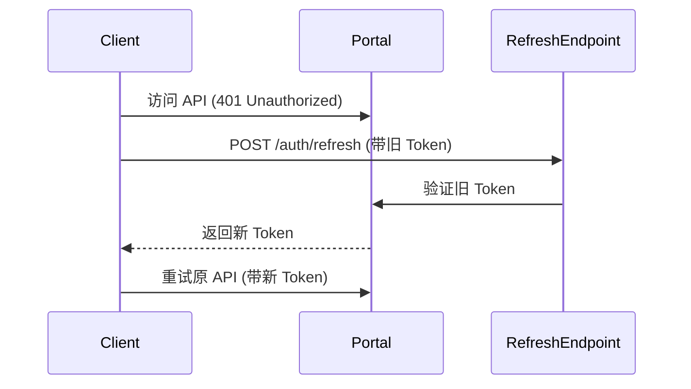

# 统一认证框架设计文档

## 概述

ONE-DATA-STUDIO-LITE 统一认证框架旨在为所有子系统提供一致的用户认证和授权服务。

### 当前认证状态

| 组件 | 当前认证方式 | 问题 |
|------|------------|------|
| Portal | JWT Token | ✅ 已实现 |
| Superset | 缓存的 admin Token | ⚠️ 硬编码凭据 |
| DataHub | Bearer Token | ⚠️ 手动配置 |
| DolphinScheduler | Token 头 | ⚠️ 手动配置 |
| SeaTunnel | 无认证 | 🔴 安全风险 |
| ShardingSphere | 无认证 | 🔴 安全风险 |
| Cube-Studio | 无认证 | 🔴 安全风险 |
| Hop | 无认证 | 🔴 安全风险 |

## 设计目标

1. **单点登录 (SSO)**: 用户登录一次即可访问所有子系统
2. **统一授权**: 基于角色的访问控制 (RBAC) 跨所有子系统
3. **Token 管理**: 统一的 Token 颁发、刷新、撤销机制
4. **审计追踪**: 所有认证和授权行为统一记录

## 架构设计

### 方案选择：OAuth 2.0 + OIDC

采用 OAuth 2.0 授权码模式 + OpenID Connect (OIDC) 协议。

```
┌─────────────┐
│   用户浏览器   │
└──────┬──────┘
       │
       ▼
┌─────────────────────────────────────────────────────────────┐
│                    ONE-DATA-STUDIO-LITE                  │
│  ┌─────────────────────────────────────────────────────┐  │
│  │              Portal (Auth Service Provider)        │  │
│  │  ┌────────────┐  ┌─────────────┐  ┌─────────────┐  │  │
│  │  │ OAuth 2.0  │  │   Token Store │  │  User Store  │  │  │
│  │  │   Server   │  │   (Redis)     │  │ (Database)   │  │  │
│  │  └────────────┘  └─────────────┘  └─────────────┘  │  │
│  └─────────────────────────────────────────────────────┘  │
│                         │                                   │
│  │                        │                              │
│  ▼                        ▼                              ▼
│ ┌───────────┐        ┌───────────┐              ┌───────────┐
│ │ Superset  │        │ DataHub   │              │  Dolphin  │
│ │ (Client)   │        │ (Client)   │              │ Scheduler │
│ └───────────┘        └───────────┘              └───────────┘
│     │                      │                           │
│     ▼                      ▼                           ▼
│ ┌───────────────┐   ┌───────────────┐       ┌───────────────┐
│ │  Token Intros │   │  Token Intros │       │  Token Intros │
│ │   (验证Token)   │   │   (验证Token) │       │   (验证Token) │
│ └───────────────┘   └───────────────┘       └───────────────┘
└─────────────────────────────────────────────────────────────┘
```

## 实现方案

### 阶段一：基于 Portal 的 Token 服务（推荐）

不引入额外组件，使用 Portal 作为 Token 颁发者和验证器。

#### 1.1 Token 颁发流程



#### 1.2 Token 结构

```json
{
  "iss": "one-data-studio-lite",
  "sub": "user_id",
  "aud": ["portal", "superset", "datahub", "ds"],
  "exp": 1706739200,
  "iat": 1706652800,
  "jti": "token_id",
  "name": "用户显示名",
  "email": "user@example.com",
  "roles": ["admin", "data_scientist"],
  "permissions": ["data:read", "data:write", "pipeline:run"]
}
```

#### 1.3 子系统 Token 验证端点

**新增端点**: `GET /auth/validate`

请求头：
```
Authorization: Bearer <token>
```

响应：
```json
{
  "code": 20000,
  "message": "success",
  "data": {
    "valid": true,
    "user_id": "admin",
    "username": "admin",
    "roles": ["admin"],
    "permissions": ["data:read", "data:write"]
  },
  "timestamp": 1706659200
}
```

### 阶段二：子系统集成

#### Superset 集成

**方式**: 使用 Superset 的 REMOTE_USER 功能

1. 配置 `ENABLE_PROXY_FIX = True`
2. 配置 `SUPERSET_PROXY_FIX_HEADER = X-Forwarded-User`
3. Portal 代理请求时注入用户信息

```python
# services/portal/routers/superset.py
@router.api_route("/{path:path}")
async def superset_proxy_with_auth(path: str, ...):
    # 注入用户信息到请求头
    headers["X-Forwarded-User"] = user.username
    headers["X-Forwarded-Email"] = user.email
    headers["X-Forwarded-Groups"] = ",".join(user.roles)
    ...
```

#### DataHub 集成

**方式**: 使用 DataHub 的 Personal Access Token

1. 用户登录后，Portal 为其生成 DataHub PAT
2. 通过 DataHub CLI 或 API 注册 Token
3. 代理请求时自动注入 Token

#### DolphinScheduler 集成

**方式**: 使用 DS 的 Token 认证

1. 在 DS 中创建统一的 Token
2. 所有通过 Portal 的请求携带此 Token
3. 或使用 `TokenManager` 类自动管理

### 阶段三：Token 刷新机制

#### Refresh Token 流程



## API 设计

### 认证端点

| 端点 | 方法 | 描述 |
|------|------|------|
| `/auth/login` | POST | 用户登录，返回 JWT Token |
| `/auth/logout` | POST | 用户登出，撤销 Token |
| `/auth/refresh` | POST | 刷新 Token |
| `/auth/validate` | GET | 验证 Token 有效性 |
| `/auth/userinfo` | GET | 获取当前用户信息 |
| `/auth/users` | GET | 获取用户列表（管理员） |
| `/auth/users` | POST | 创建用户（管理员） |

### Token 中间件

各子系统添加 Token 验证中间件：

```python
# 子系统中间件示例
async def verify_token(request: Request) -> Optional[UserInfo]:
    token = request.headers.get("Authorization", "").replace("Bearer ", "")
    if not token:
        raise HTTPException(401, "Missing token")

    # 调用 Portal 验证 Token
    async with httpx.AsyncClient() as client:
        resp = await client.get(
            f"{PORTAL_URL}/auth/validate",
            headers={"Authorization": f"Bearer {token}"}
        )
        if resp.status_code != 200:
            raise HTTPException(401, "Invalid token")

        return UserInfo(**resp.json()["data"])
```

## 配置管理

### 环境变量

```bash
# ============================================================
# 统一认证配置
# ============================================================

# Token 签名密钥（所有组件共享）
JWT_SECRET=<shared-secret>

# Token 有效期（小时）
JWT_EXPIRE_HOURS=24

# Token 刷新阈值（分钟）
JWT_REFRESH_THRESHOLD_MINUTES=30

# Portal 服务地址（用于 Token 验证）
PORTAL_URL=http://localhost:8010

# 内部服务通信 Token
INTERNAL_TOKEN=<internal-service-token>

# 启用 Token 验证中间件
ENABLE_TOKEN_VERIFICATION=true
```

## 迁移步骤

### Step 1: 增强 Portal 认证服务

1. 实现 Token 验证端点 `/auth/validate`
2. 实现 Token 刷新端点 `/auth/refresh`
3. 实现 Token 撤销端点 `/auth/revoke`

### Step 2: 子系统集成

1. **Superset**: 配置 REMOTE_USER 或 API Token 认证
2. **DataHub**: 统一 PAT 管理
3. **DolphinScheduler**: 统一 Token
4. **SeaTunnel**: 添加 Token 验证
5. **ShardingSphere**: 添加 Token 验证
6. **Cube-Studio**: 添加 Token 验证
7. **Hop**: 添加 Token 验证

### Step 3: 前端适配

1. 实现自动 Token 刷新
2. 实现 401 自动重试
3. 实现 SSO 登出

## 安全考虑

1. **密钥管理**
   - 所有组件使用相同的 JWT_SECRET
   - 生产环境必须使用强随机密钥
   - 密钥定期轮换

2. **Token 安全**
   - HTTPS 传输
   - 短有效期（推荐 1-24 小时）
   - Refresh Token 轮换

3. **审计日志**
   - 记录所有登录/登出
   - 记录 Token 刷新
   - 记录验证失败

## 附录

### A. Token 权限模型

```typescript
// 权限定义
const Permissions = {
  // 数据权限
  'data:read': '读取数据',
  'data:write': '写入数据',
  'data:delete': '删除数据',

  // Pipeline 权限
  'pipeline:read': '查看 Pipeline',
  'pipeline:run': '运行 Pipeline',
  'pipeline:manage': '管理 Pipeline',

  // 系统管理权限
  'system:admin': '系统管理员',
  'system:user:manage': '用户管理',
  'system:config': '配置管理',
};

// 角色定义
const Roles = {
  admin: Object.values(Permissions),
  data_scientist: [
    'data:read', 'data:write',
    'pipeline:read', 'pipeline:run',
  ],
  analyst: ['data:read', 'pipeline:read'],
};
```

### B. 错误码定义

| 错误码 | 说明 |
|-------|------|
| 40100 | Token 缺失 |
| 40101 | Token 过期 |
| 40102 | Token 无效 |
| 40103 | Token 撤销 |
| 40300 | 权限不足 |
